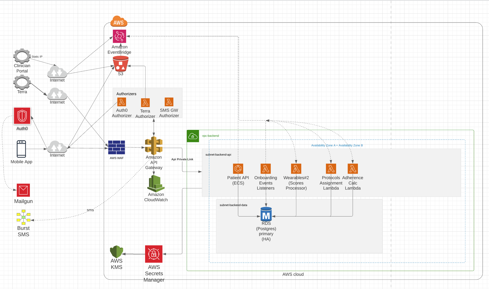

# Edison Project Knowledge

# Edison

## Description

Edison is a health clinic that has a goal of being the leading provider of personalised proactive healthcare. Roam is building an iOS app to display user’s biogenic age and help them track their health status, track their health goals and progress, and harnesses the power of wearable tech and data (particularly via Oura Rings), to give people the information they need to be their best self & live a longer, healthier life.

## Tech Stack

- Node.js with TypeScript

- AWS Lambda Functions

- AWS Lambda Authorizers

- Amazon EventBridge

- Amazon API Gateway

- AWS RDS (PostgreSQL)

- SAUCE APIs (deployed to AWS ECS)

- AWS S3

- Auth0 Tenant

- Cloud network infrastructure (VPC/Subnets)

- Other cloud infrastructure (Web App Firewall, CloudWatch , AWS KMS and Secrets Manager, IAM Roles/Users)

## Architecture Diagram

## Repository

[https://github.com/Roamltd/edison-backend-confidential](https://github.com/Roamltd/edison-backend-confidential)

## Documentation

[Edison](https://weareroam.atlassian.net/wiki/spaces/ED)
